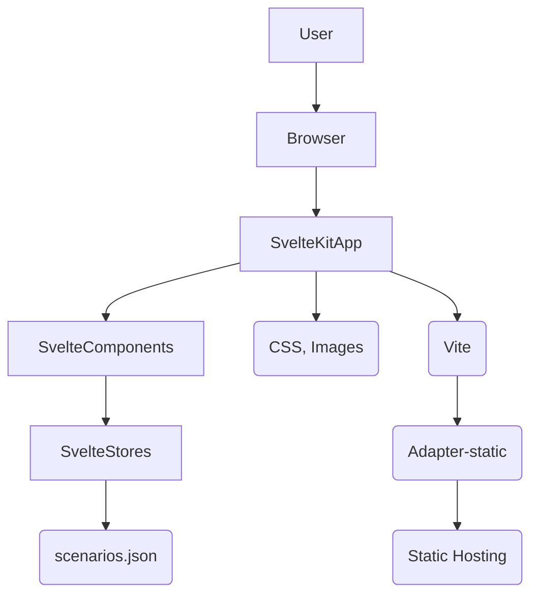
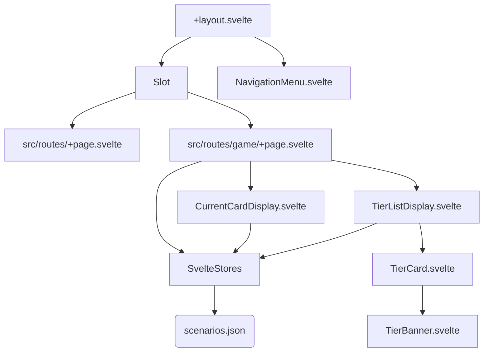

# Codes Against Academy Codebase Exploration

This document provides an overview of the Codes Against Academy codebase from the perspectives of a Software Architect, Software Developer, and Product Manager.

## 1. Software Architect's Perspective

### Overall Structure
The project is built using **SvelteKit**, a framework for building web applications with Svelte. It follows a standard SvelteKit project structure, utilizing file-system based routing.

### Key Technologies
*   **Framework:** SvelteKit (for application structure, routing, and server-side rendering/static generation capabilities)
*   **UI Library:** Svelte (for building reactive user interfaces)
*   **Language:** TypeScript (for static typing)
*   **Build Tool:** Vite (for fast development server and optimized builds)
*   **Styling:** Standard CSS and potentially TailwindCSS (indicated by dependencies in `package.json`). Styling is scoped within Svelte components using `<style>` blocks or applied globally via `app.css`.
*   **State Management:** Svelte's built-in `writable` stores are used for managing global application state, such as the current card, the full deck, and selected tiers.
*   **Data Handling:** Scenario data is loaded from a static JSON file (`src/lib/data/scenarios.json`).
*   **Deployment:** Configured to use the `@sveltejs/adapter-static`, suggesting the application is intended to be deployed as a static site or a single-page application, suitable for hosting on platforms like GitHub Pages, Netlify, Vercel (in static mode), etc.

### High-Level Architecture Diagram

*Description: This diagram illustrates the basic flow from the user's browser to the SvelteKit application, highlighting the interaction between components, stores, data, and the build/deployment process.*

### Potential Scalability Considerations
*   **Data:** For a larger number of scenarios or dynamic content, migrating from a static JSON file to a database or a headless CMS might be necessary.
*   **State Management:** While Svelte stores are suitable for this application's complexity, larger applications might consider libraries like Svelte-writable-plus or even external state managers if state logic becomes very complex.
*   **Server-Side Logic:** If dynamic features (user authentication, real-time updates, etc.) were required, a server-side component would need to be introduced, moving away from a purely static deployment model.

## 2. Software Developer's Perspective

### Project Setup and Dependencies
*   The project uses npm for package management. Key dependencies include Svelte, SvelteKit adapters, Vite, and TypeScript.
*   Development dependencies include linters (ESLint, `eslint-plugin-svelte`, `typescript-eslint`), formatters (Prettier, `prettier-plugin-svelte`, `prettier-plugin-tailwindcss`), and Svelte development tools (`svelte-check`).
*   Scripts in `package.json` provide standard development workflows: `dev` (starts development server), `build` (creates production build), `preview` (serves the production build locally), `lint` (runs linters and formatters), `format` (applies formatting).

### File Structure
The `src/` directory contains the main application code:
*   `routes/`: Contains top-level pages (`+page.svelte`) and layouts (`+layout.svelte`) using SvelteKit's file-system routing. Subdirectories like `game/`, `suggestions/`, `purchase/`, and `contact/` represent different routes.
*   `lib/`: Contains reusable components (`components/`), data files (`data/`), and utilities (like `store.ts`).
    *   `components/`: Houses Svelte components like `NavigationMenu.svelte`, `CurrentCardDisplay.svelte`, `TierListDisplay.svelte`, `TierCard.svelte`, `TierBanner.svelte`.
    *   `data/`: Contains static data files, currently `scenarios.json`.
*   `app.html`: The main HTML template for the SvelteKit application.
*   `app.css`: Global styles.
*   `app.d.ts`: TypeScript declaration file for the SvelteKit environment.

### Component Breakdown and Interaction
The application is structured around Svelte components.
*   `+layout.svelte` (src/routes/): Provides the main page layout, including the header logo and the navigation menu (conditionally rendered). It contains the `<slot />` where page content is injected.
*   `+page.svelte` (src/routes/): The home page, displaying introductory text.
*   `+page.svelte` (src/routes/game/): The core game page. It manages the game logic, including shuffling scenarios, navigating through them, and displaying the current card and tier list. It imports and uses `CurrentCardDisplay` and `TierListDisplay`.
*   `CurrentCardDisplay.svelte` (src/lib/components/): Displays the current scenario card. It likely interacts with the `currentCard` store.
*   `TierListDisplay.svelte` (src/lib/components/): Displays the tier ranking options. It likely uses `TierCard.svelte` and might interact with `allTierSelections` and `currentCardTierSelection` stores.
*   `TierCard.svelte` (src/lib/components/): Represents a single tier in the tier list.
*   `TierBanner.svelte` (src/lib/components/): Used within `TierCard.svelte` or `TierListDisplay.svelte` to display tier information.
*   `NavigationMenu.svelte` (src/lib/components/): Provides navigation links.

### State Management Implementation (`src/lib/store.ts`)
*   Defines TypeScript interfaces for `ScenarioCard`, `TierInfo`, and `CardTierSelection`.
*   Uses `svelte/store` to create `writable` stores:
    *   `fullDeck`: Stores the complete list of scenario cards.
    *   `currentCard`: Stores the scenario card currently being displayed and discussed.
    *   `currentCardTierSelection`: Stores the tier selected for the `currentCard`.
    *   `allTierSelections`: A `Map` to store the tier selection for each card, likely using the scenario text as the key.
*   Defines a constant array `tiers` containing the information for each tier level.

### Game Logic (`src/routes/game/+page.svelte`)
*   Uses Svelte lifecycle functions `onMount` and `onDestroy`.
*   On mount, it loads scenarios from `scenariosData` (imported from `scenarios.json`), shuffles them to create a `history` array, sets the `fullDeck` store, initializes the `historyIndex` to a random position, and sets the initial `currentCard` store value.
*   Provides `nextCard` and `previousCard` functions to navigate through the shuffled `history` array, implementing an infinite carousel by using the modulo operator (`%`).
*   Subscribes to the `currentCard` store to update local state.
*   Unsubscribes from the store on destroy to prevent memory leaks.
*   Uses `<CurrentCardDisplay>` and `<TierListDisplay>` components to render the UI. Navigation buttons (`prev`, `next`) call the corresponding navigation functions.

### Data Structure (`src/lib/data/scenarios.json`)
*   An array of objects, where each object represents a scenario card.
*   Each scenario object has a `scenario` property (the text of the scenario) and an optional `category` property.

### Component Hierarchy (Simplified)

*Description: A simplified view of how main components are nested and interact, showing data flow via Svelte stores.*

## 3. Product Manager's Perspective

### Product Goal
The core product is a companion web application for a physical deck of Scenario cards. Its purpose is to facilitate group discussions around the ethical considerations of using AI tools in educational settings.

### Target Audience
Groups of people, likely in educational environments (high schools, potentially universities or professional development), who are using the physical card deck.

### Core Features
*   **Scenario Display:** Presents individual scenario cards from the deck.
*   **Navigation:** Allows users to move through the deck of scenarios (previous/next, infinite carousel).
*   **Tier Ranking:** Provides a system for groups to discuss and collectively rank scenarios based on ethical considerations, assigning them to different tiers (S, A, B, C, D, E, F, Home).
*   **Tier Visualization:** Displays the defined tiers and likely provides a way to see which scenarios have been assigned to which tier.

### Data Content
The application is driven by the scenarios defined in `scenarios.json`. These scenarios appear to cover various categories of AI use (Images, Text, Learning, Video, Audio), presenting a range of ethical dilemmas.

### User Experience (UX)
*   The layout seems designed for a focused experience, with the main card display and tier ranking prominent on the game page.
*   The navigation is simple (previous/next buttons).
*   The tier ranking mechanic is a core part of the interactive experience, mimicking the physical card sorting process.

### Potential Future Enhancements
*   **Saving/Loading Sessions:** Allow groups to save their tier rankings and resume later.
*   **Custom Scenarios:** Provide a way for users to add or edit scenarios.
*   **Discussion Prompts:** Integrate prompts or questions related to each scenario to guide discussion.
*   **Reporting/Exporting:** Summarize the group's rankings or export them for later analysis.
*   **User Accounts:** If saving/loading becomes more complex or requires persistence across devices.
*   **Accessibility:** Ensure the application is accessible to users with disabilities.
*   **Multilingual Support:** If targeting a diverse user base.
*   **Enhanced Visuals/Interactions:** More sophisticated drag-and-drop for tiering, animations, etc.
*   **Integration with Physical Deck:** QR codes on physical cards linking to the digital scenario?
*   **Feedback Mechanism:** Allow users to provide feedback on scenarios or the application.

### Product Alignment
The application directly supports the use case of the physical card deck, providing a digital interface for scenario presentation and collaborative ranking, making the discussion activity potentially more structured or visually engaging. It serves as a digital tool to complement a physical product. 